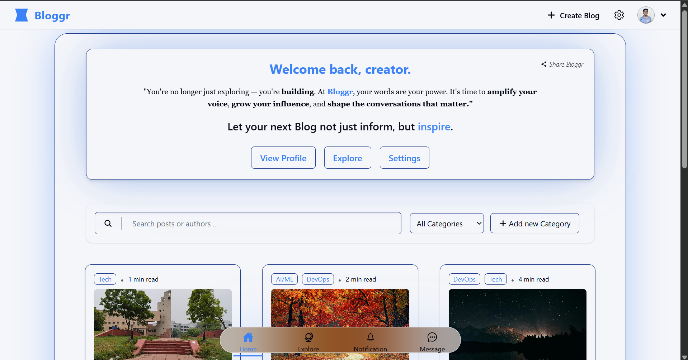
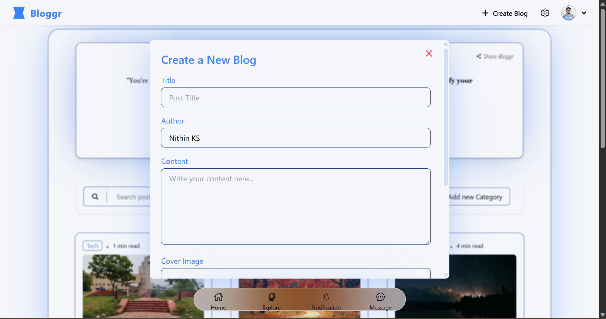
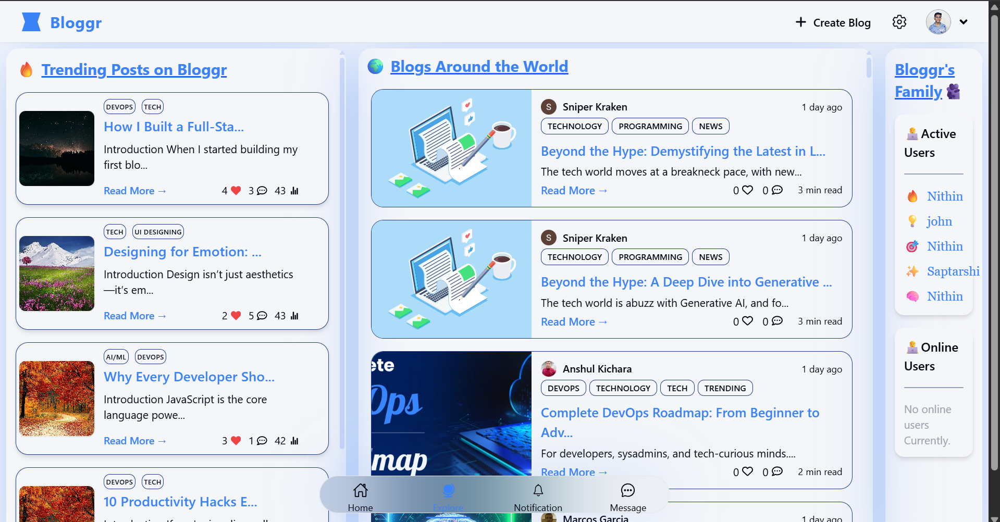
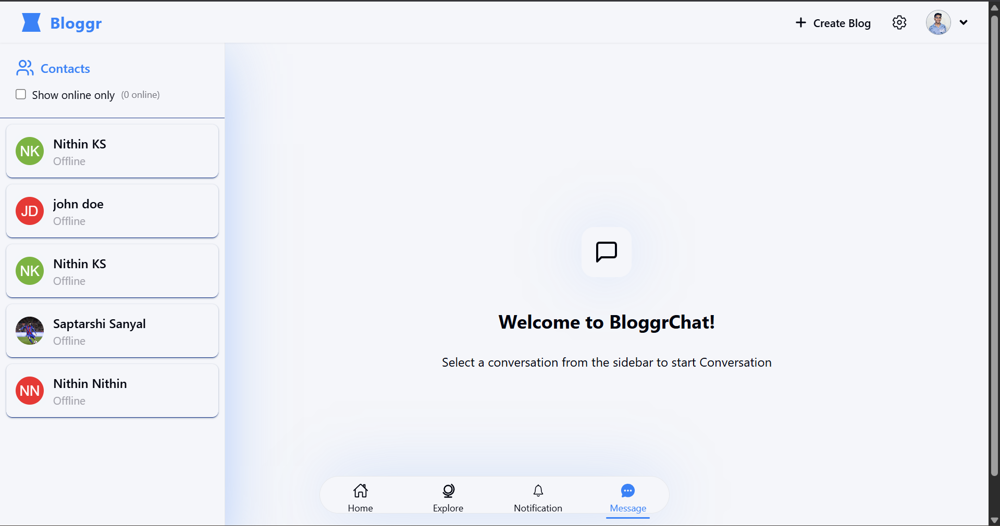
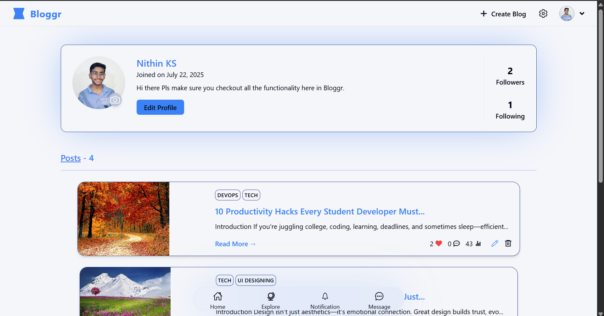
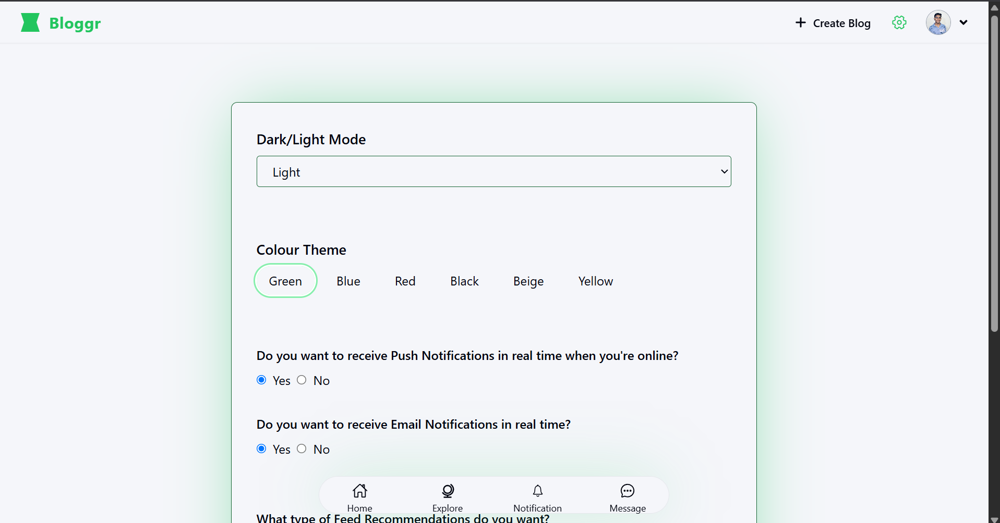
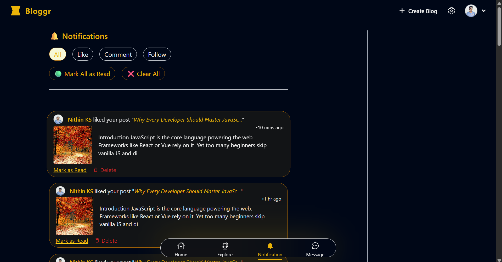

# 📝 Bloggr

🚀 **Live Demo**: [https://bloggr-y7gx.onrender.com](https://bloggr-y7gx.onrender.com)

**Bloggr** is a full-stack blogging platform built with the MERN stack. It supports real-time chat, notifications, social features like likes/comments/following, and dynamic user experiences like theming and trending blog feeds.

---

> 🖌️ **UI design assistance** was enhanced using **Google Stitch AI** for a beautifully aesthetic and user-friendly interface.

---

## 🧰 Tech Stack

| Technology        | Purpose                                  |
|-------------------|-------------------------------------------|
| **MongoDB**        | NoSQL database for storing data          |
| **Express.js**     | Backend framework for API logic          |
| **React.js**       | Frontend library for building UI         |
| **Node.js**        | JavaScript runtime for server-side       |
| **Zustand**        | Lightweight state management (client)    |
| **Socket.IO**      | Real-time messaging & notifications      |
| **Axios**          | API call handling from client            |
| **Cloudinary**     | Image upload and storage                 |
| **Multer**         | File upload middleware                   |
| **Tailwind CSS**   | Styling with utility-first classes       |
| **Lucide React**   | Icons and skeleton placeholders          |

---

## 🌟 Features

- 🔐 **Authentication**
  - Sign up with OTP verification
  - Secure login with JWT
- 📝 **Blog Management**
  - Create, edit, delete blog posts
  - Like, comment, and save blogs
- 🧵 **Real-Time Chat**
  - Individual user messaging using Socket.IO
- 🔔 **Notifications**
  - Push and email notifications for new followers, likes, comments
- 👥 **Follow System**
  - Follow/unfollow users and see their activity
- 👤 **Profile Page**
  - Upload profile pictures, bios, and manage posts
- 🌈 **Dynamic UI**
  - 6 Theme Modes + Day/Night auto switch
- 📈 **Live View Count**
  - Track number of views in real-time
- 🔍 **Explore Page**
  - Trending blogs from dev.to API
  - Discover users and content
- 🔎 **Search Functionality**
  - Search blogs by title or author
- 🗂️ **Category Filters**
  - Filter posts based on tags
- 🔧 **Admin Controls**
  - Delete own account, manage own blogs
- 📱 **Responsive Design**
  - Works great on all screen sizes

---

## 📸 Screenshots


- ![HomePage]
- ![CreateBlog]
- ![Explore]
- ![Chat]
- ![Profile]
- ![settings]
- ![Notification]

---


---

## ⚙️ Services Used

- 🔒 **JWT** for authentication
- 📧 **Nodemailer** for email verification
- 📡 **Socket.IO** for real-time features
- ☁️ **Cloudinary** for image hosting
- 📁 **Multer** for file uploads
- 📮 **Dev.to API** for external blog feed
- 🛠️ **Render** for deployment (client + server)
- 🧠 **Zustand** for global state
- 🎨 **Tailwind CSS** for responsive UI

---

## 🚀 Running Locally

```bash
# Clone the repo
git clone https://github.com/your-username/bloggr.git
cd bloggr

# Install backend dependencies
cd backend
npm install

# Create .env file in backend with:
# MONGO_URI, JWT_SECRET, CLOUDINARY creds, EMAIL creds

# Start backend server
npm run dev

# In another terminal, install frontend
cd ../frontend
npm install

# Start frontend dev server
npm run dev

## 🙌 Acknowledgments

ㆍ🧠 Inspiration: Medium, Hashnode, Twitter UI

ㆍ🔗 API Credit: Dev.to API

ㆍ👨‍💻 Developed with ❤️ by KS Nithin
```